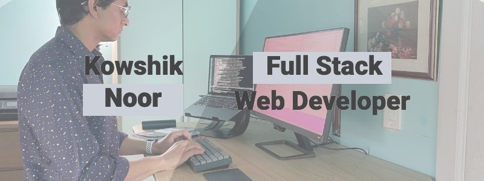

# 😃 Hello, There 👋🏽

<!--
**kowshik-noor/kowshik-noor** is a ✨ _special_ ✨ repository because its `README.md` (this file) appears on your GitHub profile.

Here are some ideas to get you started:

- 🔭 I’m currently working on ...
- 🌱 I’m currently learning ...
- 👯 I’m looking to collaborate on ...
- 🤔 I’m looking for help with ...
- 💬 Ask me about ...
- 📫 How to reach me: ...
- 😄 Pronouns: ...
- ⚡ Fun fact: ...
-->

## About Me 💁🏽‍♂️

👨🏽‍💻 My name is Kowshik Noor. I am a **Full Stack Web Developer** and a [**graduate**](https://www.linkedin.com/in/kowshik-noor-58ba9967/overlay/1635475887591/single-media-viewer/) of **Coding Dojo**. I am pursuing my Bachelor's Degree in **Computer Science** and expect to graduate in 2025.

👉🏽 I am currently making a habit of contributing to **Open Source Projects**. I love seeing the projects developers can make when they work as a team, and I am eager to do my part. During my time in Coding Dojo, I learned how to create and deploy full-stack web apps in **Python**, **Java**, and **MERN**. But my learning didn't stop here. I learned other technologies, such as **Vue**, **Docker**, and **Digital Ocean**, to create and deploy my recent project: [**H8 FIGHTER**](https://github.com/kowshik-noor/hate-fighter). I'm also starting to [**blog**](https://dev.to/kowshik_noor) about my experience. 
